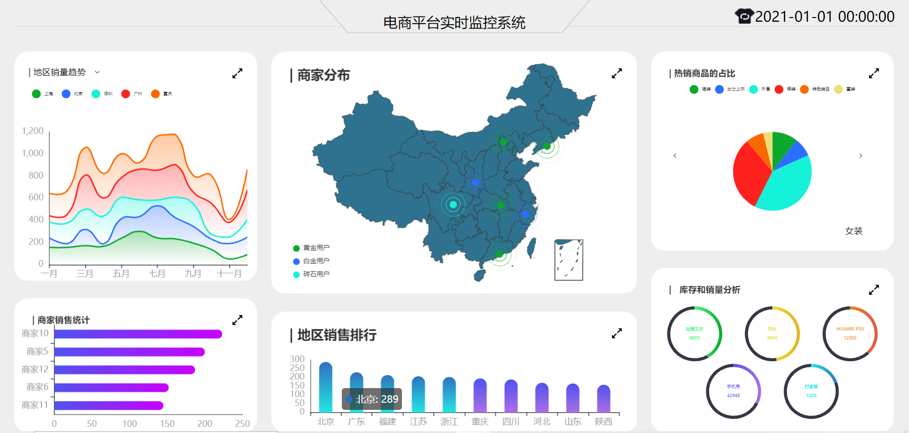

## 基于koa2 + vue2 + echarts + websocket实现的电商数据监控系统

## 项目启动

```js
npm install
```

## 启动后台

在server文件夹下
```js
node app.js
```

## 启动前端

在vision目录下

```js
npm run serve
```

## 打开浏览器访问localhost://8080


